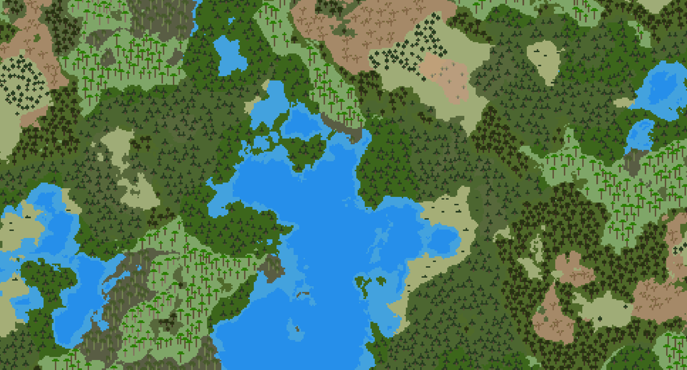

# pyprocgen

Just a procedural map generator made in Python3 for fun.

## EXAMPLE OF MAP GENERATED:

## WHAT IT DOES:

For now it only creates a .ppm picture of a map with procedural generation using Perlin noise. Maybe it will be able to create a png picture later.

## HOW TO USE IT ?

1. Download the code
2. Run pyprocgen.py with Python3
3. Enter the width then the height of the map you want, in pixels
4. Choose the mode you want to use and change options (optional)
5. Wait during processing
6. Open generated_map.ppm with your image manager, that will be create on the current folder (if it doesn't open then use your Office editor to open it)
7. Enjoy :)

## LANGUAGE:

-   User interface and code are in english.
-   Comments are only in french for the time being (maybe an english version will comes later).

## LINKS:

-   The [Perlin noise program for Python3 I used](https://github.com/caseman/noise)

-   The [origin of my biome decision model](https://upload.wikimedia.org/wikipedia/commons/thumb/c/cb/Lifezones_Pengo.svg/1200px-Lifezones_Pengo.svg.png,), from [this](https://en.wikipedia.org/wiki/Biome) Wikipedia page

## SPECIAL THANKS:

To [mindstorm38](https://github.com/mindstorm38) for his help about classes and Perlin Noise.
